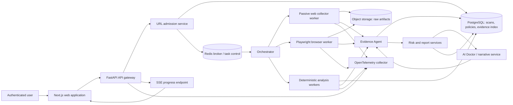
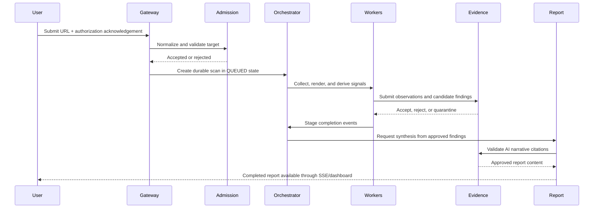
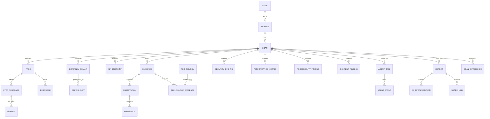
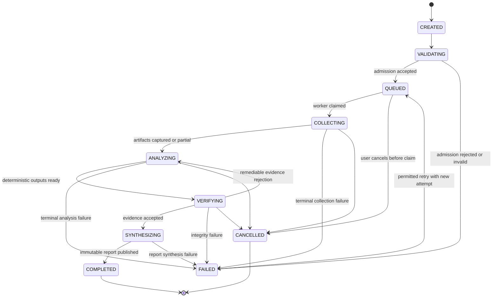

# Web Autopsy Network — Phase 0 Architecture Baseline

**Version:** 1.0 · **Status:** Architecture baseline · **Scope:** Design only; no production implementation is authorized by this document.

> **Product premise.** Web Autopsy Network passively analyzes an authorized, publicly reachable website and produces an evidence-backed report. It does not exploit targets, authenticate to them, infer hidden infrastructure as fact, or let model-generated prose bypass verifiable evidence.

## 1. Executive Decision Summary

Web Autopsy Network should be built as a **security-isolated, asynchronous analysis platform**, not as a synchronous web page or an unrestricted crawler. A browser-facing application receives a URL, explicit authorization acknowledgement, and scan options. A dedicated admission service applies URL, DNS, and policy checks before a durable job record is created. Purpose-specific workers then collect passive evidence, render public pages in isolated browser contexts, derive deterministic findings, and submit structured outputs to an Evidence Agent. Only findings that pass evidence validation can be made available to the AI Doctor or report composer.

The recommended production stack is **Next.js and TypeScript** for the user experience; **FastAPI and Python** for the control-plane API and analysis services; **Celery with Redis** for durable task routing; **PostgreSQL** as the authoritative relational record; **S3-compatible object storage** for immutable large artifacts; **Playwright** in network-restricted worker containers for rendered observations; and **OpenTelemetry** with a metrics, logs, and trace backend for operations. Celery is selected because the core workload is a finite workflow of routed, retried tasks rather than a broadly replayed streaming data product. Its own documentation describes it as a distributed task queue for real-time processing and scheduling, while Redis Streams remains a viable lighter alternative if the team later removes Celery-specific workflow needs. [1] [2]

The platform uses a four-level claim taxonomy throughout its API, database, and user interface. The terms must be rendered exactly as **OBSERVED**, **INFERRED**, **AI INTERPRETATION**, and **UNKNOWN**.

| Classification | Meaning | Permitted source | Example |
|---|---|---|---|
| **OBSERVED** | A directly captured or measured fact. | Raw collection evidence. | A response returned status 200 with an HSTS header. |
| **INFERRED** | A reproducible conclusion supported by defined evidence rules. | Deterministic rule output and referenced observations. | Multiple framework-specific build markers strongly indicate Next.js. |
| **AI INTERPRETATION** | Higher-order narrative or prioritization derived from approved structured findings. | Evidence-gated LLM output with cited finding IDs. | The current JavaScript transfer size is likely contributing to slower initial rendering. |
| **UNKNOWN** | A relevant question that cannot be established externally. | Explicit absence of sufficient observable evidence. | The database engine is unknown. |

## 2. Requirements and Scope

### 2.1 Functional requirements

The system shall accept a normalized public HTTP or HTTPS URL only after a user ticks an authorization acknowledgement. It shall persist a scan request, validate the target, schedule bounded collection, emit live state transitions, and produce a versioned report. The report shall cover reachability, redirects, observable technologies, page and resource inventory, external domains, passively observable HTTP/TLS posture, performance signals, deterministic accessibility signals, SEO/content signals, raw evidence, inferred architecture, and a structured AI narrative.

The system shall support a user dashboard, organization-ready ownership boundaries, scan history, report comparison, cancellation, bounded retries, public share links for completed reports, and an AI Doctor question flow that answers only from the selected report’s approved evidence. It shall expose the REST resources defined in Section 8 and a server-sent event stream for progress. Every report item shall identify its classification, confidence, evidence count, evidence references, collecting component, and capture time.

### 2.2 Non-functional requirements

| Area | Baseline requirement | Acceptance measure |
|---|---|---|
| Safety | The service must never issue a collection request to private, loopback, link-local, multicast, carrier-grade NAT, unique-local, metadata, or otherwise policy-denied address space. | Admission, redirect, DNS, connection-peer, egress-network, and regression-test controls all enforce the policy. |
| Privacy | No target credentials are accepted or stored. Browser contexts are ephemeral and never reuse target cookies between scans. | One non-persistent context per scan; no user credentials, host mounts, or cloud credentials in worker containers. |
| Evidence integrity | A claim must have immutable evidence references before it is visible as OBSERVED or INFERRED. | Evidence Agent rejects unreferenced or classification-invalid claims. |
| Reliability | A worker crash must not silently lose a scan. Work must be idempotent and retryable. | Durable task state, idempotency key, retry policy, dead-letter queue, and terminal failure reason. |
| Performance | Normal scans should provide first progress feedback quickly and complete under a bounded budget. | Admission under 5 seconds; target-specific worker budgets; partial report when a non-critical stage times out. |
| Accessibility | The application UI is keyboard-operable and targets WCAG 2.2 AA. Target-site automated checks are never represented as a full accessibility certification. | Product UI accessibility review; report labels distinguish automated signal from human validation. WCAG 2.2 itself expects a combination of automated tests and human evaluation. [3] |
| Auditability | Operators can correlate a submission through all worker steps and explain each result. | Trace ID, scan ID, task IDs, event log, evidence provenance, and retention policy. OpenTelemetry context propagation enables spans to be correlated across components. [4] |

### 2.3 Explicit boundaries

| In scope | Out of scope for Phase 1 / default operation |
|---|---|
| Public, unauthorized-credential-free GET/HEAD analysis of public HTTP(S) targets. | Exploitation, vulnerability confirmation, credential attacks, payload delivery, destructive tests, port scanning, or authenticated scanning. |
| Same-origin crawling under configurable hard caps. | Crawling arbitrary third-party sites or following cross-origin application flows. |
| Passive header, DOM, resource, navigation, TLS, and network-request observations. | Claiming private server configuration, databases, cloud accounts, source code, or network topology without public evidence. |
| Rendering that permits ordinary public client-side JavaScript to reveal observable page behavior. | Form submission, mutations, payment flows, user-generated actions, file downloads, or persistent browser profiles. |
| Evidence-based AI narrative and comparison of completed scans. | AI answers presented as ground truth without cited approved findings. |

The product may examine publicly served JavaScript and network requests created by page rendering, but it must not actively enumerate undocumented APIs, fuzz query parameters, test authentication, or invoke state-changing methods. A `robots.txt` policy should be evaluated before deep same-origin crawl; the default must be conservative where directives are applicable and must always honor product-level request budgets.

## 3. Use Cases and Edge Conditions

### 3.1 Primary user journeys

| Journey | User outcome | System behavior |
|---|---|---|
| Submit an authorized URL | The user receives a scan identifier and live progress. | The gateway verifies OAuth ownership and acknowledgement, then invokes admission before a job becomes QUEUED. |
| View an autopsy report | The user understands what is observed, inferred, interpreted, or unknown. | The report reads only approved findings, groups evidence by section, and supports evidence drill-down. |
| Compare two completed scans | The user sees a bounded, explainable change set. | The History/Difference service compares normalized snapshots and emits `ScanDifference` records with both evidence sources. |
| Ask the AI Doctor | The user receives a scoped answer about a completed scan. | The service retrieves approved report findings, constrains the LLM to them, and stores answer citations. |
| Share a report | A recipient can view a completed, intentionally shared immutable report. | A revocable opaque share token resolves a redacted report without sign-in; raw evidence defaults to owner-only unless explicitly included. |

### 3.2 Edge conditions

| Condition | Required handling | Result classification |
|---|---|---|
| Malformed URL, non-HTTP(S) scheme, userinfo, encoded host ambiguity, literal IP, or non-public DNS answer | Reject before queueing and record an admission event without network collection. | Not a target finding; `FAILED` admission outcome. |
| DNS rebinding or redirect to a non-public address | Revalidate every redirect and actual connection peer; deny and terminate the fetch. | OBSERVED platform safeguard event; scan may complete partially or fail safely. |
| Unreachable, refused, certificate-failing, or timeout target | Capture the exact connection-stage observation; no retry beyond bounded transient policy. | OBSERVED reachability result. |
| JavaScript-heavy site | Use the isolated browser lane after initial HTTP collection; record render timeout if applicable. | OBSERVED rendered/unrendered distinction. |
| Site behind login, CAPTCHA, paywall, or consent wall | Do not bypass. Capture public boundary and report the inaccessible surface as unknown. | OBSERVED boundary plus UNKNOWN for hidden content. |
| Rate limiting or robots restriction | Back off, reduce concurrency, stop the bounded crawl, and disclose incomplete coverage. | OBSERVED limitation. |
| Target returns untrusted instructions or prompt-injection text | Treat all target content as data, not instructions; never change worker behavior based on page text. | Security event if relevant; never operational control. |

## 4. Refined System Architecture

### 4.1 Architecture diagram

The **starting architecture is deliberately changed in five ways**. First, no component may fetch a URL until a separate admission service accepts it; this prevents collection logic from becoming the only SSRF boundary. OWASP recommends URL validation controls, redirect controls, DNS/IP monitoring, and network segmentation for SSRF protection. [5] Second, the Evidence Agent is made a mandatory write gate, not an optional analytical agent. Third, browser analysis is separated from standard collection because browser execution has different resource, isolation, and network-risk properties. Playwright browser contexts provide isolated, clean-slate storage and cookies, which is appropriate for one-scan-per-context handling. [6] Fourth, a graph database and vector database are deferred: normalized relational evidence plus object storage is sufficient for v1 and avoids premature operational complexity. Fifth, the event channel is SSE rather than bidirectional WebSockets because scan progress is server-to-client and can be resumed with an event ID; WebSockets can be added only if a true interactive streaming use case emerges.

### 4.2 Component responsibilities

| Component | Responsibility | Boundary and trust level |
|---|---|---|
| Web application | OAuth login, acknowledgement capture, dashboards, report visualization, share UI. | Never receives collector credentials or raw worker-network access. |
| API gateway | AuthN/AuthZ, API contracts, rate limits, scan ownership, share-token resolution, SSE fan-out. | Stateless control plane; only service authorized to serve private report data. |
| URL admission service | Canonicalize URL, enforce target policy, DNS/IP checks, redirect plan rules, scan budgets, idempotency. | The only component allowed to enqueue target collection. |
| Orchestrator | Advance state machine, route idempotent tasks, apply retry/cancel policy, aggregate partial completion. | Cannot invent findings or bypass Evidence Agent. |
| Passive collector | Perform controlled GET/HEAD navigation, capture raw HTTP/TLS/HTML/resource-link evidence. | No target credentials; hardened egress; no browser execution. |
| Browser worker | Render public pages, capture DOM/network/timing/screenshot artifacts. | Ephemeral sandbox, one browser context per scan, no host secrets, policy-aware request interception. |
| Deterministic engines | Convert raw artifacts into technologies, security signals, performance metrics, accessibility signals, SEO/content signals. | Rules are versioned and emit reproducible evidence links. |
| Evidence Agent | Validate schema, provenance, evidence references, classification rules, and claim consistency. | Mandatory gate for all reportable findings and AI output. |
| Risk/impact service | Rank approved findings using transparent scoring and business-facing severity guidance. | Cannot escalate unknowns into factual claims. |
| AI Doctor and narrative service | Produce structured interpretation and answers from approved evidence only. | No crawler/network client; output must cite finding IDs and return through Evidence Agent. |
| Report service | Materialize immutable report revisions and share-safe redactions. | Reads approved evidence only. |
| Observability plane | Trace, metric, log, audit, and alert collection. | Redacts URLs/query values and never exports secrets or page bodies by default. |

### 4.3 Scan data flow

## 5. Agent and Service Boundary Matrix

The following agents are logical services. “AI-driven” does not mean autonomous access to target systems; it means constrained interpretation of structured internal input.

| Agent/service | Mode | Inputs | Outputs | Justification |
|---|---|---|---|---|
| Orchestrator | Deterministic | Scan state, task events, policy | Routed tasks, lifecycle transitions | State changes and retry rules must be auditable. |
| URL/Admission Service | Deterministic | Raw URL, user/plan policy | Canonical target, accepted/rejected admission record | SSRF policy cannot rely on a model. |
| Web Collector | Deterministic | Admitted target and budgets | HTTP, TLS, HTML, link, header, cookie observations | Collection must be repeatable and tightly bounded. |
| Browser Analysis Worker | Deterministic execution | Admitted target, browser policy | Rendered DOM, resource graph, timings, screenshot | Controlled browser automation surfaces observable behavior. |
| Technology Intelligence Engine | Deterministic-first | Markers, headers, scripts, DOM | Technology candidates and evidence | Signatures are inspectable and reproducible. |
| Structure Agent | Deterministic | DOM, sitemap/link graph | Page structure and architecture observations | Structural extraction does not require generative reasoning. |
| API Intelligence Agent | Deterministic-first | Captured passive network requests | Observable endpoint/service relationships | No endpoint guessing, fuzzing, or active probing. |
| Network Intelligence Agent | Deterministic | DNS, redirect, external-domain observations | Domain/dependency graph | It describes observed relationships only. |
| Security Analysis Engine | Deterministic | TLS, headers, cookies, HTML/browser signals | Passive posture findings | Security checks must not exploit or make unsafe requests. |
| Performance Engine | Deterministic | Resource timings, transfer sizes, page milestones | Performance metrics and bottleneck signals | Metrics come directly from capture. |
| Accessibility Engine | Deterministic | DOM semantics and automated rules | Accessibility signals and manual-review gaps | Automated testing is incomplete by standard design. [3] |
| Content/SEO Engine | Deterministic-first | Meta tags, headings, canonical, robots, structured data | SEO/content findings | Rule checks are transparent; summarization is separate. |
| Business Intelligence Agent | AI-driven, optional | Approved findings only | Clearly marked AI INTERPRETATION | Adds prioritization without pretending to observe business facts. |
| History/Difference Engine | Deterministic | Two normalized completed scans | ScanDifference records | Diffing snapshots is reproducible. |
| Evidence Agent | Deterministic gate with optional semantic consistency check | Candidate findings, evidence IDs, AI output | Accepted, rejected, quarantined claims | Prevents unsupported claims from reaching reports. |
| Reasoning/AI Doctor | AI-driven | Approved evidence package, question/report template | Citation-bearing interpretation | It cannot crawl and cannot state unsupported observations. |
| Risk/Impact Engine | Deterministic-first | Approved findings, confidence, exposure context | Priority and “Cause of Death” candidate | Consistent scoring; AI may explain but not alter source facts. |
| Report Agent | Deterministic composition with AI narrative | Approved report model | Versioned report and share redaction | Presentation must preserve provenance. |

## 6. Data and Evidence Model

### 6.1 Core entity model

All entities use an opaque UUID primary key, UTC timestamps, soft deletion where user-controlled, and a `tenant_id`/owner boundary suitable for organizations. Raw artifacts are stored outside the database in object storage; the relational database stores hashes, immutable locations, metadata, and relationships.

| Entity | Key relationships | Critical fields and constraints | Important indexes |
|---|---|---|---|
| `User` | Owns `Website`, `Scan`, `Report`, `ShareLink`. | OAuth subject unique; status; created/updated timestamps. | Unique OAuth subject; tenant membership lookup. |
| `Website` | Belongs to `User`/tenant; has many `Scan`. | Canonical origin; registrable domain; target policy snapshot. | Unique `(tenant_id, canonical_origin)`. |
| `Scan` | Belongs to `Website`; has pages, tasks, findings, report. | Lifecycle state, requested URL, policy/version, correlation ID, budgets, started/completed timestamps. | `(tenant_id, created_at)`, `(website_id, created_at)`, `(state, updated_at)`, idempotency key. |
| `Page` | Belongs to `Scan`; has `HTTPResponse`, resources, findings. | Canonical URL, depth, fetch mode, content hash, crawl disposition. | Unique `(scan_id, canonical_url)`; `(scan_id, depth)`. |
| `Resource` | Belongs to `Page`; maps to `ExternalDomain`. | URL, type, transfer size, initiator, local/third-party class, object ref. | `(scan_id, normalized_url)`; `(page_id, resource_type)`. |
| `HTTPResponse` | Belongs to `Page`. | Status, final URL, protocol, timings, MIME type, body hash, redirect chain ref. | `(page_id, captured_at)`; `(scan_id, status_code)`. |
| `Header` | Belongs to `HTTPResponse`. | Lowercase name, value or redacted hash, ordinal. | `(http_response_id, name)`. |
| `Technology` | Catalog entity; linked through evidence. | Canonical name, category, signature version. | Unique `(canonical_name, category)`. |
| `TechnologyEvidence` | Joins `Technology`, `Scan`/`Page`, and `Evidence`. | Match rule, confidence, evidence ID. | `(scan_id, technology_id)`; evidence lookup. |
| `ExternalDomain` | Belongs to `Scan`; receives dependencies/resources. | Registrable domain, role, first/last observed timestamps. | Unique `(scan_id, registrable_domain)`. |
| `Dependency` | Links site/page to `ExternalDomain` or technology. | Relationship type, direction, classification, evidence ID. | `(scan_id, source_id, target_id)`. |
| `APIEndpoint` | Belongs to `Scan` and optional `ExternalDomain`. | Method, normalized path template, observed-only flag, evidence ID. | Unique `(scan_id, method, normalized_path)`. |
| `SecurityFinding` | Belongs to `Scan`; references `Finding`/`Evidence`. | Rule ID, severity, remediation, classification. | `(scan_id, severity)`, `(scan_id, rule_id)`. |
| `PerformanceMetric` | Belongs to `Scan`/`Page`. | Metric name, numeric value, unit, capture mode, evidence ID. | `(scan_id, metric_name)`. |
| `AccessibilityFinding` | Belongs to `Scan`/`Page`. | Rule ID, WCAG reference if applicable, confidence, manual-review flag. | `(scan_id, rule_id)`. |
| `ContentFinding` | Belongs to `Scan`/`Page`. | Category, status, normalized value, evidence ID. | `(scan_id, category)`. |
| `Observation` | Belongs to `Scan`; links to raw `Evidence`. | Subject, predicate, value, collection method, classification=`OBSERVED`. | `(scan_id, subject, predicate)`; evidence ID. |
| `Inference` | Belongs to `Scan`; references observations. | Rule version, conclusion, confidence, classification=`INFERRED`. | `(scan_id, rule_id)`; confidence. |
| `AIInterpretation` | Belongs to `Scan`/`Report`; references approved findings. | Prompt/template version, model policy, claim list, classification=`AI INTERPRETATION`. | `(scan_id, created_at)`; report revision. |
| `Evidence` | Belongs to `Scan`; supports all claim types. | Type, source component, object URI, content hash, capture timestamp, sensitivity, immutable flag. | `(scan_id, evidence_type)`, content hash, source component. |
| `ScanDifference` | Compares a current scan to baseline scan. | Subject, change type, old/new finding IDs, evidence refs. | Unique `(scan_id, baseline_scan_id, fingerprint)`. |
| `AgentTask` | Belongs to `Scan`; has events. | Queue lane, attempt, idempotency key, state, started/finished timestamps. | `(scan_id, state)`, unique task idempotency key. |
| `AgentEvent` | Belongs to `AgentTask` and `Scan`. | Event type, state sequence, structured payload ref, trace ID. | `(scan_id, sequence_no)`; `(task_id, created_at)`. |
| `Report` | Belongs to `Scan`; has AI interpretations and share links. | Revision, status, immutable rendered snapshot, content hash, completion time. | Unique `(scan_id, revision)`; completed scan lookup. |
| `ShareLink` | Belongs to `Report`. | Opaque token hash, scope, expiry, revocation timestamp. | Unique token hash; active expiry lookup. |

### 6.2 ER diagram

### 6.3 Evidence contract and gating rules

Each reportable finding conforms to the following **data contract**, represented here as a specification rather than implementation code.

| Field | Requirement |
|---|---|
| `finding_id` | Immutable opaque identifier. |
| `scan_id`, `subject`, `category` | Identify the scan, the observed subject, and the report domain. |
| `classification` | Exactly one of OBSERVED, INFERRED, AI INTERPRETATION, UNKNOWN. |
| `statement` | Concise, non-speculative claim. |
| `confidence` | Numeric score and calibrated band; required for INFERRED and AI INTERPRETATION. |
| `evidence[]` | Non-empty for OBSERVED, INFERRED, and AI INTERPRETATION. Each item carries evidence ID, type, source component, observation time, content hash/object reference, and excerpt/redaction. |
| `rule_or_prompt_version` | Required for deterministic inferences and AI interpretations. |
| `limitations` | Required when scope, timing, crawl budget, robots policy, rendering, or access boundaries reduce coverage. |
| `created_at`, `supersedes_id` | Preserve provenance and report-revision lineage. |

The Evidence Agent rejects an OBSERVED claim without direct evidence; an INFERRED claim without an approved rule and all rule-required observations; and an AI INTERPRETATION claim without citations to approved findings. It also rejects claims that name an unobserved vendor, backend technology, vulnerability, breach, or configuration. Rejected claims are quarantined in audit storage and never reach the report. A natural-language model is therefore **not a source of fact**; it is a constrained transformation that must survive evidence validation.

### 6.4 Branded “Cause of Death” diagnosis

The branded final section is a risk-triage interface, not an assertion that the target is compromised, unavailable, or “dead.” It must be titled **Cause of Death** and contain a visible disclaimer that it summarizes the principal observed risk or quality issue from this scan. Its record has `primary_issue`, `secondary_issues[]`, `contributing_factors[]`, `confidence`, `evidence_count`, `classification_mix`, `limitations`, and linked finding IDs. If the evidence is insufficient, it must state **UNKNOWN — insufficient externally observable evidence** rather than invent a diagnosis.

## 7. Scan Lifecycle State Machine

The internal lifecycle is intentionally more detailed than the customer dashboard. The dashboard may map progress to `queued`, `running`, `completed`, and `failed`, but the authoritative scan state uses the following machine.

Every transition is an append-only `AgentEvent` with state sequence number, actor/task ID, timestamp, trace ID, reason code, and retryability. A cancellation is cooperative: workers receive a cancellation token between bounded operations, never leave a child browser process alive, and preserve safely collected evidence as incomplete rather than presenting it as full coverage.

## 8. API and Live Progress Specification

The public API is versioned under `/v1`. It uses OAuth bearer sessions for private routes and an opaque report-share token for public report read routes. The API contract should be published as OpenAPI 3.1, the standard interface format designed for humans and machines to understand HTTP API capabilities. [7]

| Method and path | Auth | Purpose | Success response |
|---|---|---|---|
| `POST /v1/scans` | User | Submit URL, acknowledgment, and approved scan options. | `202 Accepted` with scan ID, dashboard status `queued`, and SSE URL. |
| `GET /v1/scans/{id}` | Owner/tenant | Read scan metadata, lifecycle state, limits, and failure/cancel context. | `200` scan summary. |
| `POST /v1/scans/{id}/cancel` | Owner/tenant | Request cooperative cancellation for non-terminal scan. | `202` cancellation requested. |
| `GET /v1/scans/{id}/progress` | Owner/tenant | Return current state, stage, percent band, and recent events. | `200` progress snapshot. |
| `GET /v1/scans/{id}/overview` | Owner/tenant or permitted share scope | Read approved overview. | `200` classified findings. |
| `GET /v1/scans/{id}/technologies` | Same | Read technologies and supporting evidence. | `200` technology graph. |
| `GET /v1/scans/{id}/architecture` | Same | Read observed/inferred architecture relationships. | `200` relationship model. |
| `GET /v1/scans/{id}/dependencies` | Same | Read first- and third-party dependencies. | `200` dependency collection. |
| `GET /v1/scans/{id}/security` | Same | Read passive security posture findings. | `200` findings and limitations. |
| `GET /v1/scans/{id}/performance` | Same | Read captured performance signals. | `200` metrics and coverage. |
| `GET /v1/scans/{id}/accessibility` | Same | Read automated accessibility signals and manual-review caveats. | `200` findings. |
| `GET /v1/scans/{id}/content` | Same | Read SEO/content summary and source signals. | `200` findings. |
| `GET /v1/scans/{id}/history` | Same | Read baseline comparisons and scan timeline. | `200` differences. |
| `GET /v1/scans/{id}/evidence` | Owner by default; share scope optional | Paginate redacted raw evidence manifest and approved excerpts. | `200` evidence page. |
| `POST /v1/scans/{id}/ask` | Owner/tenant | Submit a scoped AI Doctor question. | `202` answer job or `200` cited answer. |
| `GET /v1/scans/{id}/events` | Owner/tenant | SSE stream of state and progress events. | `200 text/event-stream`. |
| `POST /v1/reports/{id}/share-links` | Report owner | Create a revocable, expiry-bound share link. | `201` one-time display token/URL. |
| `GET /v1/shared/{token}` | Public | Read a completed, share-safe report projection. | `200` report or `410` revoked/expired. |

All collection-creating requests require an `Idempotency-Key`; duplicate keys return the original scan. `POST /v1/scans` fails closed unless `authorization_acknowledged` is a literal boolean true. Validation failures return `422`; ownership failures `404` to avoid disclosure; rate policy violations `429`; and terminal worker failures are represented as a scan state rather than exposed worker internals.

The SSE stream emits `scan.state_changed`, `scan.stage_progress`, `scan.warning`, `scan.partial_result`, and `scan.completed` events. Each event contains an event ID, scan ID, lifecycle state, dashboard status, event timestamp, sequence number, and safe summary. Clients reconnect with `Last-Event-ID`; the gateway replays from `AgentEvent` records. This provides live updates without polling or a persistent bidirectional socket.

## 9. Technology Decisions and Deployment Topology

| Concern | Decision | Rationale | Explicit non-decision |
|---|---|---|---|
| Frontend | Next.js, TypeScript, Tailwind CSS, component primitives, React Query, Cytoscape.js for relationship graphs. | Strong routing, shareable report rendering, type safety, accessible composability, and mature graph visualization. | A chat-first UI is rejected; the report is the primary product. |
| API/control plane | FastAPI, Pydantic, OpenAPI 3.1. | Python aligns with collection/analysis libraries and gives contract-first validation. | Synchronous in-process scan handlers are rejected. |
| Distributed execution | Celery workers, Redis broker/result-control plane, named task lanes. | Explicit retries, routing, worker pools, and task monitoring fit finite multi-stage scan workflows. [1] | Kafka is deferred: no current need for high-throughput replayable multi-consumer event streams; it adds operational overhead. |
| Authoritative storage | PostgreSQL. | Strong relationships, transactions, row-level tenancy policy, JSONB for variable evidence metadata, and mature indexing. | Redis is not the system of record. |
| Artifact storage | S3-compatible object storage with encryption, object lock/retention, content hashes. | Raw HTML, HAR-like records, screenshots, and trace artifacts are too large for relational storage. | Database BLOB storage is rejected. |
| Browser automation | Playwright in a hardened container. | Isolated browser contexts offer separate cookies/local/session storage and reproducible public render capture. [6] | Shared profiles and target credentials are rejected. |
| AI | Provider-agnostic structured-output adapter; schema-constrained models; central prompt/model registry. | Model swapping and evidence validation remain possible without product rewrite. | Direct free-form model output to report is rejected. |
| Observability | OpenTelemetry Collector; metrics, logs, and traces exported to managed Prometheus/Grafana/Loki/Tempo or equivalent. | Trace context links request, queue, worker, evidence, and report steps. [4] | Logs alone are insufficient for asynchronous diagnosis. |
| Infrastructure | Docker images deployed to Kubernetes/ECS-like isolated worker pools, managed PostgreSQL/Redis/object storage, private service network, controlled egress proxy. | Browser and collector jobs require separate resource, egress, and security policies. | A single monolithic web process is rejected for production. |

Two viable execution approaches were considered. A **Celery + Redis** architecture is recommended because Python workers and multi-step job routing are central to the product. A **Redis Streams consumer-group** implementation is lighter and gives explicit stream acknowledgement semantics, but would require the team to implement more workflow, retry, scheduling, and routing patterns itself. Redis documents stream operations such as consumer-group reads, while Celery explicitly positions itself as a distributed task queue with real-time processing and scheduling support. [1] [2]

## 10. Security Model and Threat Model

### 10.1 URL admission and SSRF controls

The system must deny private/internal access **at every stage**, not merely at input validation. This defense-in-depth approach follows OWASP guidance to control URL handling, redirects, DNS/IP resolution, and network routes. [5]

| Control point | Required policy |
|---|---|
| Parse and normalize | Accept only absolute `http` or `https` URLs with a domain hostname; reject userinfo, fragments, raw IP literals, ambiguous encodings, oversized values, invalid IDNA, and dangerous ports. |
| DNS evaluation | Resolve A and AAAA through a controlled resolver; reject a hostname if any candidate connection address is non-global or denied. Cache short-lived resolution evidence. |
| Connection | Use an egress proxy or validated resolver-to-connect path that rechecks the selected peer IP immediately before connection, protecting against DNS rebinding/TOCTOU. |
| Redirects | Disable automatic following. Re-admit each `Location` target and limit redirects to five; reject any cross-policy or non-public target. |
| Egress network | Worker network policy permits only TCP 80/443 through the egress proxy and denies RFC1918, loopback, link-local, unique-local IPv6, CGNAT, multicast, reserved ranges, DNS rebinding routes, cloud metadata ranges, cluster/service CIDRs, and control-plane endpoints. |
| Browser | Intercept every navigation and subresource request; block non-HTTP(S), downloads, WebRTC, private egress, and state-changing methods. Browser runs as a non-root, no-secret, no-host-mount, read-only-root filesystem container with CPU/memory/pid/time limits. |
| Request budget | Default 20 pages, 100 resources, depth 2, five redirects, 10 concurrent requests per scan, 2 requests per host per second, 60 seconds collector time, and 120 seconds browser time. Budgets are plan- and policy-capped, never caller-unbounded. |

### 10.2 Platform threat model

| Threat | Attack surface | Mitigations | Residual handling |
|---|---|---|---|
| SSRF and cloud metadata access | User-supplied URL and redirects | Admission, DNS/peer revalidation, egress proxy, network policy, blocked literals and ports. | Fail closed; create redacted audit event. |
| DNS rebinding | DNS answer changes between checks | Controlled DNS plus connect-time peer validation and isolated egress. | Reject connection and mark scope incomplete. |
| Crawl spam/resource exhaustion | Submission, queue, browser workers | OAuth, authorization checkbox, per-user/domain quotas, token bucket limits, idempotency, queue quotas, autoscaling ceilings, cancellation. | Backpressure and `429`; dead-letter anomalous workloads. |
| Malicious HTML/JS/browser escape | Rendered target content | Patched browser, sandboxing, seccomp/AppArmor, no credentials, no host network, no shared context, egress restriction. | Kill and quarantine failed worker; preserve no executable artifact. |
| Prompt injection | Target page content and AI question field | Treat target as untrusted data; separate instructions from evidence; structured schemas; evidence gate; no tool/network access for AI Doctor. | Log rejected prompt patterns; never change policy. |
| Data leakage through shares | Report links and raw artifacts | Opaque hashed tokens, expiry/revocation, least-privilege report projection, owner-only raw evidence by default, query-value/cookie redaction. | Immediate revoke and audit. |
| Broken object authorization | Scan/report API | Tenant-scoped database access, authorization middleware, indirect-object tests, non-enumerable IDs. | `404` externally; security event internally. |
| Evidence tampering | Worker/report pipeline | Content hashes, immutable object locations, append-only events, signature/version fields, report revisions. | Quarantine on hash/provenance mismatch. |
| Dependency/supply-chain compromise | Worker images and libraries | Signed images, SBOM, dependency scanning, lock files, minimal images, patch cadence. | Block release or isolate version; reprocess affected scans if necessary. |

The platform does not provide a security assessment certification. It reports passive observations and derived posture signals at a particular time, under stated coverage limits.

## 11. Scalability, Isolation, and Operations

The gateway and report-read APIs are stateless and scale independently from workers. Redis task lanes divide work into `admission`, `collector`, `browser`, `deterministic-analysis`, `ai`, and `report` queues. Each worker pool has independent autoscaling, concurrency, timeout, memory, and per-domain policy. Browser workers should scale more conservatively than HTTP collectors due to CPU and memory pressure; AI workers should additionally be budgeted by token and provider-rate limits.

Concurrency is isolated at three levels. First, a database-backed lease and queue key prevent duplicate work for the same scan. Second, a registrable-domain semaphore limits concurrent scans and requests against a single target domain. Third, each browser scan receives a new non-persistent context and bounded container. The relationship graph and evidence database are partitioned by tenant/scan; large artifacts use prefix-based object storage and lifecycle expiration. PostgreSQL can partition high-volume event and evidence tables by month or scan completion window as volume requires.

Workers are idempotent: their inputs contain the scan ID, policy version, stage name, attempt number, and idempotency key. A retry writes a new task attempt but never silently overwrites a prior artifact. Exponential retry applies only to transient, policy-allowed failures. Terminal failures remain explainable and preserve safe partial evidence. A dead-letter workflow surfaces repeatedly failing stages to operators without repeatedly contacting the target.

Operational telemetry records scan rate, admission rejections, blocked private-IP attempts, queue depth and age by lane, worker saturation, task duration, browser crash rate, evidence rejection rate, AI cost/latency, report completion rate, share-link access anomalies, and per-domain request rate. A trace begins at submission and crosses the queue into worker spans through context propagation. [4] Alerts should prioritize violations of the SSRF guardrail, abnormal blocked-egress attempts, error-budget breaches, queue aging, and evidence-gate rejection spikes.

## 12. Phase 1 Readiness and Delivery Checklist

The following decisions are sufficiently resolved for a delivery team to begin the foundation phase: the product is passive-only; its source of truth is evidence; admission and network egress are independent security controls; claims use a fixed classification taxonomy; Celery plus Redis is the initial distributed execution mechanism; PostgreSQL and object storage retain immutable report provenance; browser work is isolated; and the UI’s branded diagnosis cannot overstate technical certainty.

Before implementation starts, the team should turn this baseline into an ADR set, an OpenAPI 3.1 document, a database migration plan, worker image hardening manifests, network-policy tests, an SSRF regression corpus, and interface designs for the report sections. The first implementation milestone must include admission and egress-policy tests before any crawler is connected to a user-submitted URL.

## References

[1]: https://docs.celeryq.dev/en/stable/ "Celery 5.6 Documentation"
[2]: https://redis.io/docs/latest/develop/data-types/streams/ "Redis Streams Documentation"
[3]: https://www.w3.org/TR/WCAG22/ "W3C Web Content Accessibility Guidelines 2.2"
[4]: https://opentelemetry.io/docs/concepts/signals/traces/ "OpenTelemetry: Traces"
[5]: https://cheatsheetseries.owasp.org/cheatsheets/Server_Side_Request_Forgery_Prevention_Cheat_Sheet.html "OWASP Server-Side Request Forgery Prevention Cheat Sheet"
[6]: https://playwright.dev/docs/browser-contexts "Playwright: Browser Context Isolation"
[7]: https://swagger.io/specification/ "OpenAPI Specification"
